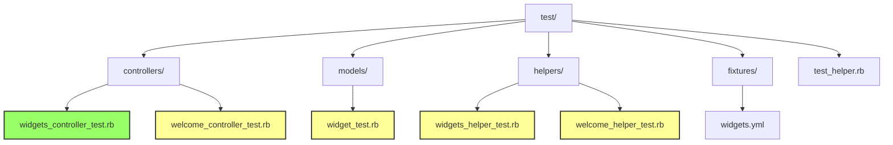
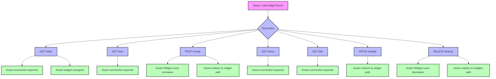
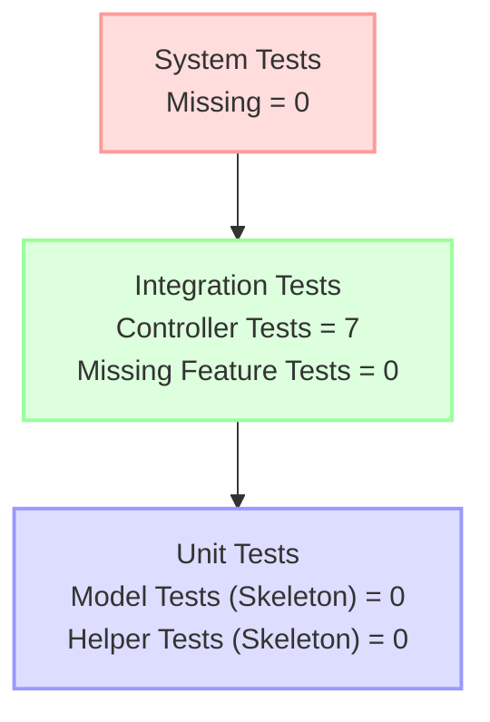

# Testing Framework in Ruby Demo

## Overview of Rails Testing Framework

The Ruby Demo application employs Rails' built-in testing framework, which provides a comprehensive suite of tools for testing different components of the application. The testing architecture follows Rails conventions with distinct test types organized by architectural layer. The framework leverages ActiveSupport::TestCase for model tests, ActionController::TestCase for controller tests, and ActionView::TestCase for helper tests.

The testing structure in Ruby Demo demonstrates a typical Rails testing approach with separate files for each component being tested. The test suite is configured through a central test_helper.rb file that establishes the test environment and provides common functionality across all tests. While the controller tests are well-implemented with comprehensive coverage of CRUD operations, the model and helper tests are currently skeletal, suggesting an incomplete testing strategy that focuses primarily on controller functionality.

The application uses fixtures for test data, which provides a consistent and predictable dataset for tests. This approach is evident in the WidgetsControllerTest, which loads widget fixtures for testing various controller actions. The testing framework also employs various assertion methods to verify expected behaviors, such as assert_response, assert_difference, and assert_redirected_to.

## Test Directory Structure

The test directory structure follows Rails conventions, organizing tests by their architectural layer. The diagram shows the hierarchical organization with controllers, models, and helpers each having their own subdirectory. The implemented tests (shown in green) are primarily in the controllers directory, specifically the widgets_controller_test.rb file. The skeleton tests (shown in yellow) include the welcome_controller_test.rb, widget_test.rb, and both helper test files, indicating areas where test coverage could be expanded. The fixtures directory contains YAML files that define test data used across the test suite, with widgets.yml being a key fixture file for the implemented controller tests.

## Test Environment Configuration

The test_helper.rb file serves as the central configuration point for the Ruby Demo test environment. It begins by ensuring the Rails environment is set to 'test' using the conditional assignment operator (`ENV['RAILS_ENV'] ||= 'test'`), which preserves any existing environment setting but defaults to 'test' if none is specified. This approach ensures tests run in a consistent environment regardless of how they're invoked.

The file then loads the application environment by requiring the Rails environment configuration, which initializes the application with test-specific settings. The inclusion of 'rails/test_help' brings in Rails' testing utilities, providing access to assertions, fixtures, and other testing tools.

The ActiveSupport::TestCase class is extended to configure global test behavior. The `fixtures :all` directive automatically loads all fixture files from the test/fixtures directory, making test data available to all test cases. This approach ensures data consistency across tests and simplifies test setup.

The file also provides an extension point with a commented section for adding custom helper methods that would be available to all test cases. This is a strategic location for implementing shared test functionality, such as authentication helpers or custom assertions, though the Ruby Demo application doesn't currently utilize this capability.

The minimal nature of the test_helper.rb file suggests a straightforward testing approach without complex custom configurations or integrations with external testing tools, which is appropriate for a demonstration application but might need expansion in a production environment.

## Controller Testing Approach

The controller testing strategy in Ruby Demo is exemplified by the WidgetsControllerTest class, which provides comprehensive coverage of the CRUD operations exposed by the WidgetsController. The approach follows Rails' conventional controller testing pattern, focusing on verifying HTTP responses, object assignments, database state changes, and redirect behaviors.

Each controller action is tested with a dedicated test method that simulates an HTTP request and verifies the expected outcomes. The tests use a consistent pattern:

1. Setup phase: The test fixture `@widget` is initialized in the setup method, providing a consistent test subject across all test cases.
2. Action phase: HTTP requests are simulated using methods like `get`, `post`, `patch`, and `delete` that correspond to HTTP verbs.
3. Assertion phase: Various assertions verify the expected behavior, such as:
   - `assert_response` to check HTTP status codes
   - `assert_not_nil assigns(:widgets)` to verify controller instance variables
   - `assert_difference` to confirm database record changes
   - `assert_redirected_to` to validate proper redirection

The test for each action is focused and specific, testing only the behavior relevant to that action. For example, the "should get index" test verifies both a successful response and the assignment of the widgets collection, while the "should create widget" test verifies both the database record creation and the subsequent redirection.

This approach ensures that each controller action behaves as expected from an HTTP perspective, making it a form of integration testing that verifies the controller's interaction with both the model layer (through database operations) and the view layer (through response and redirection assertions).

## Controller Test Workflow

The controller test workflow diagram illustrates the lifecycle of controller tests in the Ruby Demo application. The process begins with a setup phase where fixtures are loaded, providing consistent test data. From there, each test action simulates a specific HTTP request to the controller, followed by assertions that verify the expected behavior.

The diagram shows how each controller action (index, new, create, show, edit, update, destroy) has its own test path with specific assertions. For example, the create action test verifies both that the Widget count increases and that the user is redirected to the appropriate path. Similarly, the destroy action test ensures that the Widget count decreases and that redirection occurs.

This workflow demonstrates a comprehensive testing strategy that covers all aspects of the controller's responsibility: processing requests, interacting with the model layer, and directing the appropriate response or redirection. The use of fixtures provides a stable baseline for testing, ensuring that tests are repeatable and consistent.

## Model Testing Structure

The model testing approach in Ruby Demo is currently minimal, as evidenced by the skeleton implementation in widget_test.rb. The file establishes the basic structure by inheriting from ActiveSupport::TestCase, which provides the foundation for Rails model testing, but contains no actual test implementations. The commented-out "the truth" test is merely a placeholder showing the syntax for a test method.

A robust model testing strategy would typically include tests for:

1. **Validations**: Verifying that models enforce data integrity constraints such as presence, uniqueness, and format validations.
2. **Associations**: Ensuring that relationships between models are correctly established and function as expected.
3. **Scopes**: Testing custom query methods that filter or order model instances.
4. **Instance Methods**: Validating behavior of custom methods defined on model instances.
5. **Class Methods**: Testing functionality of methods defined at the class level.
6. **Callbacks**: Verifying that before/after hooks execute correctly during model lifecycle events.

The absence of implemented tests in widget_test.rb suggests that either the Widget model has minimal business logic that requires testing, or that the test suite is incomplete. Given that the controller tests are well-implemented, it's likely the latter, indicating an area for improvement in the test coverage.

Best practices for implementing model tests would include organizing tests by the aspect being tested (validations, methods, etc.), using descriptive test names that specify the expected behavior, and focusing on testing business logic rather than framework functionality. Each test should be isolated and focused on a single aspect of the model's behavior to ensure clarity and maintainability.

## Helper Testing Framework

The helper testing approach in Ruby Demo is represented by the minimal implementations in welcome_helper_test.rb and widgets_helper_test.rb. Both files establish test classes that inherit from ActionView::TestCase, which is Rails' specialized testing framework for view helpers. ActionView::TestCase provides a simulated view context that allows helper methods to be called and tested as they would be in actual views.

The empty test classes suggest that either the corresponding helper modules (WelcomeHelper and WidgetsHelper) contain no methods that require testing, or that the test suite is incomplete. Given the pattern of skeleton test files seen elsewhere in the application, it's likely the latter.

ActionView::TestCase integrates with the broader testing strategy by providing a focused environment for testing view-specific logic. Helper tests complement controller and model tests by ensuring that the presentation layer functions correctly. They allow developers to verify that helper methods generate the expected HTML, format data correctly, or make appropriate decisions based on the view context.

When implemented, helper tests would typically:
1. Call helper methods with various inputs
2. Assert that the returned values or generated HTML matches expectations
3. Test conditional logic within helpers
4. Verify integration with other helpers or view components

The integration of helper tests into the testing pyramid would place them at a level between unit tests (model tests) and integration tests (controller tests), focusing on the presentation logic that transforms model data into view-appropriate formats.

## Test Assertion Types

```mermaid
graph TD
    A[Test Assertions in Ruby Demo] --> B[Response Assertions]
    A --> C[Assignment Assertions]
    A --> D[Database Change Assertions]
    A --> E[Redirection Assertions]
    
    B --> B1[assert_response :success]
    B1 --> B1a[Verifies HTTP status code is successful]
    
    C --> C1[assert_not_nil assigns&#40;:widgets&#41;]
    C1 --> C1a[Confirms controller assigned the expected variable]
    
    D --> D1[assert_difference 'Widget.count']
    D1 --> D1a[Verifies record count changes as expected]
    D --> D2[assert_difference 'Widget.count', -1]
    D2 --> D2a[Verifies record deletion]
    
    E --> E1[assert_redirected_to widget_path]
    E1 --> E1a[Confirms proper redirection after action]
    E --> E2[assert_redirected_to widgets_path]
    E2 --> E2a[Verifies redirection to index page]
    
    classDef category fill:#f9f,stroke:#333,stroke-width:2px
    classDef assertion fill:#bbf,stroke:#333,stroke-width:2px
    classDef description fill:#bfb,stroke:#333,stroke-width:2px
    
    class A,B,C,D,E category
    class B1,C1,D1,D2,E1,E2 assertion
    class B1a,C1a,D1a,D2a,E1a,E2a description
```

The diagram categorizes the various assertion methods used throughout the Ruby Demo test suite. These assertions form the backbone of the testing strategy, allowing for verification of different aspects of application behavior.

Response assertions like `assert_response :success` verify that controllers return the expected HTTP status codes, ensuring proper communication with clients. Assignment assertions such as `assert_not_nil assigns(:widgets)` confirm that controllers correctly populate instance variables that will be used by views, validating the controller-view interface.

Database change assertions using `assert_difference` are crucial for verifying that controller actions correctly modify the application's state. These assertions check that records are created, updated, or deleted as expected, confirming the controller-model interaction. The ability to specify a negative count difference (-1) allows for precise testing of deletion operations.

Redirection assertions with `assert_redirected_to` validate the application's flow control, ensuring users are directed to appropriate pages after actions complete. This tests an important aspect of user experience and application navigation logic.

Together, these assertion types provide comprehensive coverage of controller behavior, testing HTTP responses, variable assignments, database operations, and navigation flow. The strategic use of these assertions enables thorough verification of application functionality while maintaining readable and maintainable tests.

## Fixture Usage Strategy

The Ruby Demo application employs fixtures as its primary strategy for providing test data. This approach is evident in the test_helper.rb file, which includes the directive `fixtures :all` to automatically load all fixture files for all tests. Fixtures provide a consistent and predictable dataset that remains stable across test runs, ensuring test reliability and repeatability.

In the controller tests, particularly WidgetsControllerTest, fixtures are leveraged through the setup method, which initializes `@widget = widgets(:one)`. This references a specific fixture named "one" from the widgets.yml fixture file. The fixture provides a pre-defined Widget instance with known attributes, which serves as the subject for various test operations such as showing, editing, updating, and destroying.

The fixture-based approach offers several advantages:
1. **Consistency**: All tests operate on the same baseline data, reducing test flakiness.
2. **Efficiency**: Fixtures are loaded once per test class, improving test performance.
3. **Simplicity**: Test setup is minimized since data is pre-defined.
4. **Readability**: Tests can focus on assertions rather than data creation.

However, the exclusive use of fixtures also has limitations:
1. **Rigidity**: Fixtures are static and cannot easily adapt to specific test scenarios.
2. **Maintenance**: As the application evolves, fixtures must be updated to remain valid.
3. **Complexity**: Large fixture sets can become difficult to manage and understand.

The Ruby Demo application's use of fixtures is appropriate for its scope, providing sufficient test data for controller tests. For a more complex application, a hybrid approach combining fixtures for baseline data with dynamic object creation for specific test scenarios might be more flexible and maintainable.

## Test Coverage Analysis

The test coverage in Ruby Demo shows a significant imbalance across different components of the application. The controller layer, particularly the WidgetsController, has comprehensive test coverage with tests for all CRUD operations. These tests verify HTTP responses, object assignments, database changes, and redirect behaviors, providing thorough validation of the controller's functionality.

In contrast, the model layer has minimal coverage. The WidgetTest class exists but contains no implemented tests, suggesting that model validations, associations, and business logic are not being verified. This represents a significant gap in the test suite, as model-level bugs could go undetected despite passing controller tests.

Similarly, the helper layer has skeleton test files (WelcomeHelperTest and WidgetsHelperTest) but no actual test implementations. If the helper modules contain any significant functionality, this represents another coverage gap.

The WelcomeController also has a test file but with no implemented tests. Given that this controller likely handles the application's entry point, this is another area where coverage could be improved.

Notably absent from the test suite are:
1. **System tests**: There are no tests that verify the application's behavior from an end-user perspective.
2. **Integration tests**: Beyond controller tests, there are no tests that verify the interaction between multiple components.
3. **View tests**: There's no direct testing of view templates.

This analysis suggests that while the application has a solid foundation for testing, particularly for controller functionality, there are significant opportunities to improve coverage across other components. A more balanced approach would include implemented tests for models, helpers, and views, as well as higher-level integration and system tests.

## Testing Pyramid Implementation

The testing pyramid diagram illustrates the current state of the Ruby Demo test suite in relation to the ideal testing pyramid concept. The testing pyramid suggests that a well-balanced test suite should have a large base of unit tests, a smaller middle layer of integration tests, and a small top layer of system tests.

In Ruby Demo, the pyramid is inverted. The integration layer, represented by controller tests, is well-developed with seven implemented test methods in WidgetsControllerTest. These tests verify the interaction between controllers, models, and routing, making them integration tests by nature.

The unit test layer, which should form the foundation of the testing strategy, is underdeveloped. Both model tests and helper tests exist only as skeleton files without implemented tests. This suggests that the lowest-level components of the application are not being thoroughly tested in isolation.

The system test layer, which would typically include end-to-end tests that verify the application from a user's perspective, is entirely missing. There are no tests that simulate user interactions through the browser or verify the complete functionality of features.

This inverted pyramid approach has implications for the test suite's effectiveness:
1. It may catch integration issues but miss fundamental problems in individual components
2. It lacks verification of the user experience and end-to-end workflows
3. It may be more brittle and slower than a suite with more unit tests

To achieve a more balanced testing pyramid, the application would benefit from implementing the skeleton unit tests and adding system tests to verify end-user functionality.

## Testing Framework Enhancement Opportunities

The Ruby Demo testing framework presents several opportunities for enhancement to achieve a more comprehensive and balanced testing strategy. These recommendations focus on addressing the gaps identified in the current implementation while building upon its existing strengths.

1. **Implement Model Tests**: The skeleton WidgetTest class should be expanded to include tests for:
   - Validations of name, description, and stock attributes
   - Any associations with other models
   - Custom scopes or query methods
   - Business logic encapsulated in model methods

2. **Develop Helper Tests**: The empty helper test classes should be populated with tests that verify:
   - HTML generation functions
   - Data formatting methods
   - Conditional display logic

3. **Add System Tests**: Introduce system tests using frameworks like Capybara to verify:
   - End-to-end user workflows
   - JavaScript interactions
   - Form submissions and validations from a user perspective

4. **Implement Feature Tests**: Add feature-level tests that verify complete user stories across multiple controllers and actions.

5. **Enhance Test Data Strategy**: While fixtures provide a solid foundation, consider:
   - Using factories (with tools like FactoryBot) for more flexible test data creation
   - Implementing traits for common variations of test objects
   - Creating more comprehensive fixture sets for complex scenarios

6. **Add View Tests**: Implement tests that verify view templates render correctly with different data scenarios.

7. **Improve Test Helper**: Expand the test_helper.rb file to include:
   - Custom assertions for common verification patterns
   - Helper methods for authentication and authorization in tests
   - Utilities for testing common patterns

8. **Implement Welcome Controller Tests**: Complete the skeleton WelcomeControllerTest to ensure the application's entry point is properly tested.

9. **Add Test Coverage Reporting**: Integrate tools like SimpleCov to quantify test coverage and identify specific areas needing attention.

10. **Consider Test-Driven Development**: For future development, adopt a TDD approach to ensure new features are thoroughly tested from inception.

These enhancements would transform the testing framework from its current controller-focused approach to a comprehensive strategy that verifies all aspects of the application, from individual components to complete user workflows.

[Generated by the Sage AI expert workbench: 2025-03-29 18:36:01  https://sage-tech.ai/workbench]: #