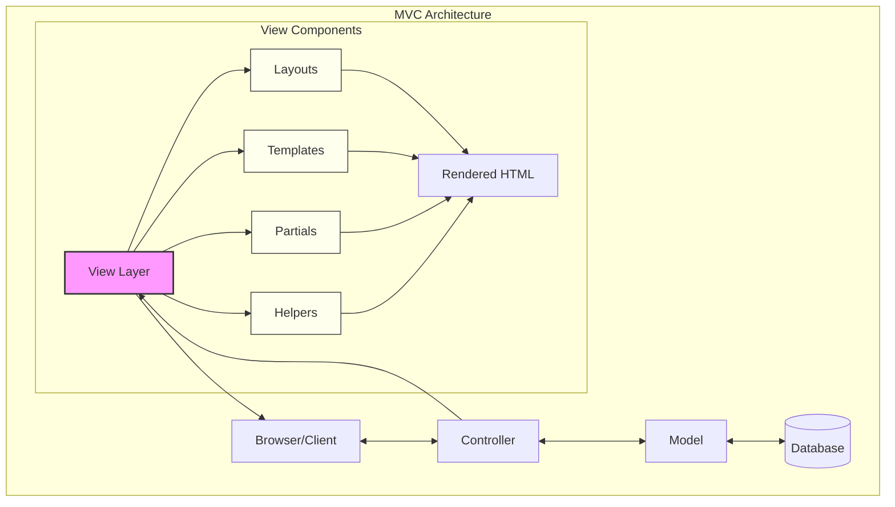
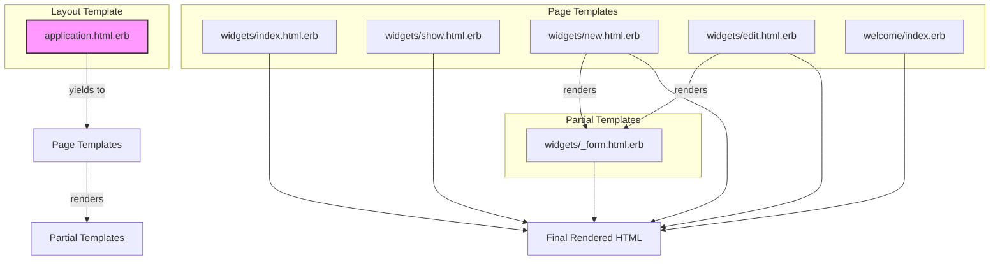
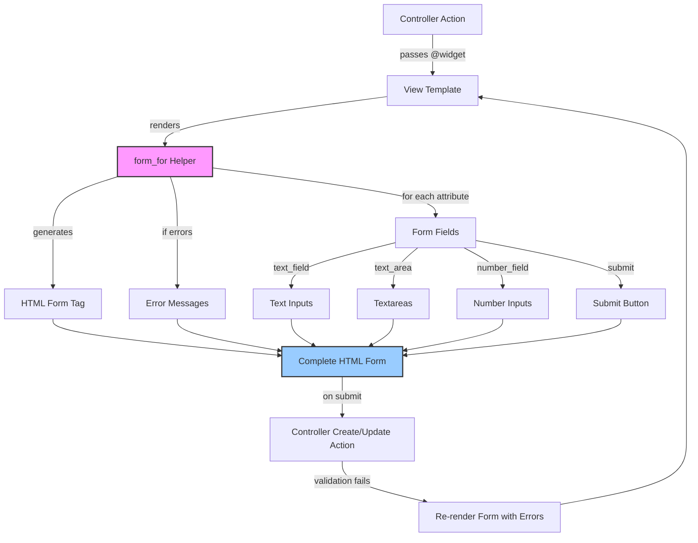
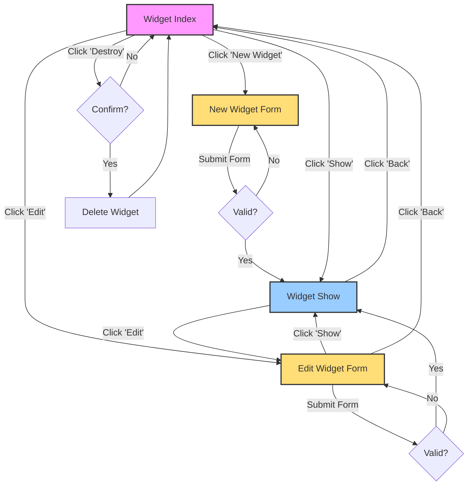

# View Components in Ruby on Rails

## Introduction to View Components in Ruby on Rails

View components in Ruby on Rails represent a critical part of the MVC (Model-View-Controller) architecture, serving as the presentation layer that users directly interact with. These components encapsulate the presentation logic of an application, separating it from business logic and data management concerns. In the Rails framework, view components primarily consist of ERB (Embedded Ruby) templates, layouts, partials, and view helpers that work together to generate HTML output.

The primary purpose of view components is to maintain a clear separation of concerns. While controllers handle request processing and models manage data and business rules, views are responsible solely for presenting information to users in a readable, accessible format. This separation enhances maintainability by allowing developers to modify the presentation layer without affecting the underlying application logic.

In modern Rails applications, view components have evolved beyond simple templates to include more sophisticated patterns like ViewComponent (a library that implements component-based UI patterns), Cells, and other abstraction mechanisms that further encapsulate presentation logic. These approaches help manage complexity in large applications by creating reusable, testable UI elements with well-defined interfaces.

## MVC Architecture with View Components



The diagram illustrates how view components fit within the Rails MVC architecture. When a request arrives, the controller interacts with models to retrieve or manipulate data, then selects the appropriate view to render. Within the view layer, multiple components work together: layouts provide the overall structure, templates contain page-specific content, partials offer reusable view fragments, and helpers provide utility methods for formatting and presentation.

This architecture ensures a clean separation between data management and presentation concerns. The controller passes data to views through instance variables, but the views themselves contain only presentation logic, not business rules. This separation makes the application more maintainable and allows specialists to work on different aspects of the system without interfering with each other's domains.

## ERB Templates in Ruby Demo

ERB (Embedded Ruby) templates form the backbone of the view layer in the Ruby Demo application. These templates combine HTML markup with Ruby code, allowing dynamic content generation while maintaining a clear structure. ERB uses special tags to embed Ruby code within HTML:

- `<%= %>` - Evaluates Ruby code and outputs the result
- `<% %>` - Evaluates Ruby code without outputting anything
- `<%# %>` - Comments that are not included in the output

In the Ruby Demo application, ERB templates are used extensively to render dynamic content. For example, in the widgets index view (`widgets/index.html.erb`), we see Ruby code embedded to iterate through the collection of widgets:

```erb
<% @widgets.each do |widget| %>
  <tr>
    <td><%= widget.name %></td>
    <td><%= widget.description %></td>
    <td><%= widget.stock %></td>
    <!-- Action links -->
  </tr>
<% end %>
```

This pattern allows the template to dynamically generate table rows based on the data provided by the controller. The ERB syntax maintains a clear separation between HTML structure and the Ruby logic that populates it with data.

ERB templates in Rails follow naming conventions that map to controller actions. For instance, the `index` action in the `WidgetsController` automatically renders the `widgets/index.html.erb` template unless specified otherwise. This convention-over-configuration approach reduces the need for explicit view specifications in controller code.

## Layout Templates and Application Structure

The application layout template (`application.html.erb`) serves as the master template that provides a consistent structure across all pages in the Ruby Demo application. This layout defines the overall HTML structure, including the `<head>` section with metadata, stylesheets, and JavaScript includes, as well as common UI elements like the navigation bar.

The layout template uses several key Rails features:

1. Asset inclusion with helpers like `javascript_include_tag` and `stylesheet_link_tag`, which generate appropriate HTML tags and handle asset fingerprinting for caching purposes.

2. Security features like `csrf_meta_tags`, which inserts meta tags for Cross-Site Request Forgery protection.

3. The critical `<%= yield %>` statement, which acts as a placeholder where page-specific content from individual view templates is inserted.

The navigation bar in the layout provides consistent access to application features and external resources across all pages. It uses Bootstrap's navbar component with dropdown menus and glyphicons for a polished user interface.

By centralizing common elements in the layout template, the Ruby Demo application achieves consistency across pages while allowing individual view templates to focus solely on their specific content. This approach follows the DRY (Don't Repeat Yourself) principle by eliminating the need to duplicate header, footer, and navigation code across multiple templates.

## View Template Hierarchy



The diagram illustrates the hierarchical relationship between different view components in the Ruby Demo application. At the top level, the application layout (`application.html.erb`) provides the common structure for all pages. When a specific page is requested, the corresponding template (such as `widgets/index.html.erb`) is rendered within the layout's yield point.

Page templates may further render partial templates to handle specific UI components. For example, both the new and edit widget pages render the same form partial (`_form.html.erb`), promoting code reuse. This hierarchical structure allows for a modular approach to view composition, where complex pages can be built from smaller, reusable components.

The view template hierarchy follows Rails conventions, with templates organized by controller and action names. This organization makes it easy to locate the appropriate template for a given action and understand the overall structure of the application's user interface.

## Partial Templates for Code Reuse

Partial templates are a powerful feature in Rails that promote the DRY (Don't Repeat Yourself) principle by enabling view code reuse across multiple pages. In the Ruby Demo application, the `_form.html.erb` partial exemplifies this approach by providing a single implementation of the widget form that's used in both the new and edit views.

The form partial encapsulates all the complexity of form rendering, including:

1. Setting up the form with the appropriate action URL and HTTP method based on whether the widget is new or existing
2. Displaying validation errors when present
3. Rendering input fields for all widget attributes
4. Providing a submit button with context-appropriate text

By extracting this functionality into a partial, the application avoids duplicating complex form code across multiple views. When changes to the form are needed, they can be made in a single location, ensuring consistency throughout the application.

Partials are identified by their filename prefix (underscore) and are rendered using the `render` method:

```erb
<%= render 'form' %>
```

This simple syntax belies the power of partials, which can also accept local variables to customize their behavior in different contexts. The convention of prefixing partial filenames with an underscore helps distinguish them from regular templates while making it clear that they're not meant to be rendered directly.

In larger applications, partials can be organized into subdirectories and shared across controllers, further enhancing code reuse and maintainability. This modular approach to view composition is a cornerstone of Rails' view architecture.

## Rails View Helpers

Rails view helpers are utility methods that simplify common HTML generation tasks, making templates more concise and readable. The Ruby Demo application leverages several built-in helpers to generate HTML elements, links, and forms.

The `link_to` helper creates anchor tags with the appropriate URLs and attributes. For example:

```erb
<%= link_to 'Edit', edit_widget_path(@widget) %>
```

This generates an HTML link to the edit page for a specific widget, handling URL generation through the Rails routing system. The helper can also include additional attributes like HTTP method and confirmation dialogs:

```erb
<%= link_to 'Destroy', widget, method: :delete, data: { confirm: 'Are you sure?' } %>
```

The `form_for` helper simplifies form creation by automatically setting up the correct action URL, HTTP method, and CSRF protection based on the model object:

```erb
<%= form_for(@widget) do |f| %>
  <!-- Form fields -->
<% end %>
```

Within the form block, field helpers like `f.text_field`, `f.text_area`, and `f.number_field` generate appropriate input elements with labels and current values pre-filled.

Other helpers used in the application include:

- `asset_path` for generating URLs to static assets
- `pluralize` for correctly pluralizing words based on count
- `javascript_include_tag` and `stylesheet_link_tag` for including JavaScript and CSS files

These helpers abstract away the complexities of HTML generation, allowing developers to focus on the application's behavior rather than markup details. They also ensure consistent HTML output and adherence to Rails conventions across the application.

## Form Rendering Process



The diagram illustrates how the `form_for` helper in Rails generates HTML forms based on model objects. The process begins when a controller action passes a model instance (like `@widget`) to a view template. The `form_for` helper then generates an HTML form with the appropriate action URL and method based on whether the model is a new record or an existing one.

If the model contains validation errors (typically after a failed save attempt), the form displays these errors at the top. The helper then generates form fields for each model attribute using field helpers like `text_field`, `text_area`, and `number_field`. These helpers automatically set the field name, id, and current value based on the model's attributes.

The form concludes with a submit button whose text adapts to the context ("Create Widget" for new records, "Update Widget" for existing ones). When submitted, the form data is sent to the appropriate controller action, which attempts to save the model. If validation fails, the controller re-renders the form with error messages, creating a feedback loop until valid data is submitted.

This process abstracts away much of the complexity of form handling, including proper field naming for mass assignment, error display, and form submission, allowing developers to focus on the business logic rather than form mechanics.

## Bootstrap Integration

The Ruby Demo application integrates the Bootstrap CSS framework to provide responsive design and consistent styling across the application. This integration is evident in both the layout template and individual view templates.

In the application layout (`application.html.erb`), Bootstrap is included via CDN links:

```erb
<%= stylesheet_link_tag '//maxcdn.bootstrapcdn.com/bootstrap/3.3.4/css/bootstrap.min.css' %>
<%= javascript_include_tag '//maxcdn.bootstrapcdn.com/bootstrap/3.3.4/js/bootstrap.min.js' %>
```

This approach ensures that users receive the latest version of Bootstrap without requiring the application to bundle it directly.

Throughout the application, Bootstrap classes are used to style UI elements:

1. The navigation bar uses Bootstrap's navbar component with classes like `navbar-default`, `navbar-static-top`, and `navbar-inverse`.

2. The welcome page uses the jumbotron component for a prominent header area and Bootstrap's grid system (`container`, `row`, `col-md-6`) for responsive layout.

3. Tables are styled with the `table` class for consistent appearance.

4. Buttons use classes like `btn`, `btn-lg`, `btn-default`, and `btn-primary` to achieve a polished look.

5. Alert messages use the `alert` and `alert-info` classes for styling.

This integration demonstrates how Rails views can leverage external CSS frameworks to achieve professional styling without extensive custom CSS. The combination of Rails' view helpers and Bootstrap's CSS classes creates a clean, responsive user interface with minimal effort.

## RESTful Resource Representation

The view templates in the Ruby Demo application map directly to RESTful actions for the Widget resource, creating a consistent user interface for CRUD operations. Each standard RESTful action has a corresponding view template that presents the resource in an appropriate format:

1. **Index** (`widgets/index.html.erb`): Displays a table of all widgets with columns for each attribute and action links for individual records. This provides an overview of the resource collection.

2. **Show** (`widgets/show.html.erb`): Presents a detailed view of a single widget, displaying all its attributes in a readable format. This view focuses on information consumption rather than interaction.

3. **New** (`widgets/new.html.erb`): Provides a form for creating a new widget, with empty fields for all required attributes. This view is focused on data entry for resource creation.

4. **Edit** (`widgets/edit.html.erb`): Similar to the new view but pre-populated with the existing widget's data. This view enables modification of an existing resource.

Both the new and edit views leverage the same form partial (`_form.html.erb`), demonstrating how similar interfaces can share implementation while maintaining distinct URLs and contexts.

The views also include navigation links that follow RESTful conventions. For example, the show view includes links to edit the current widget or return to the index, while the index view provides links to show, edit, or destroy each widget.

This consistent mapping between RESTful actions and view templates creates a predictable user experience and reinforces the resource-oriented nature of the application. Users can easily navigate between different representations of the resource, performing CRUD operations through a coherent interface.

## Widget CRUD Interface Flow



The diagram illustrates the user flow between different widget views and how they correspond to CRUD operations. The widget index serves as the central hub, providing access to all other operations. From there, users can:

1. **Create** a new widget by clicking "New Widget", which leads to a form. Upon successful submission, users are redirected to the show view for the newly created widget.

2. **Read** widget details by clicking "Show" on a specific widget in the index, which displays all attributes of that widget.

3. **Update** a widget by clicking "Edit" either from the index or show view, which presents a pre-populated form. After successful submission, users return to the show view to see their changes.

4. **Delete** a widget by clicking "Destroy" in the index, which prompts for confirmation before permanently removing the widget.

Each view provides appropriate navigation links to move between related actions, creating a cohesive user experience. The flow follows RESTful conventions, with each operation corresponding to a specific HTTP method and URL pattern.

This interface flow demonstrates how Rails' convention-over-configuration approach extends to the user interface, creating a predictable pattern for resource manipulation that remains consistent across different resources in the application.

## Best Practices for View Components

The Ruby Demo application demonstrates several best practices for view components in Rails applications:

1. **Separation of Concerns**: The views focus exclusively on presentation, leaving business logic to controllers and models. This clean separation enhances maintainability by allowing specialists to work on different aspects of the system without interference.

2. **Code Reuse through Partials**: The application uses partials like `_form.html.erb` to avoid duplicating complex view code. This DRY approach ensures consistency and simplifies maintenance by centralizing common UI components.

3. **Consistent Layout Structure**: The application layout provides a unified structure across all pages, ensuring a consistent user experience and reducing redundancy in view templates.

4. **Leveraging View Helpers**: The application uses Rails helpers like `link_to`, `form_for`, and `asset_path` to generate HTML, reducing boilerplate code and ensuring adherence to Rails conventions.

5. **Integration with CSS Frameworks**: Bootstrap integration provides responsive design and professional styling without extensive custom CSS, demonstrating how external frameworks can enhance Rails views.

6. **RESTful Resource Representation**: View templates map directly to RESTful actions, creating a consistent interface for resource manipulation that follows web standards.

7. **Proper Error Handling**: Form templates include error display mechanisms that provide clear feedback when validation fails, enhancing usability.

8. **Contextual Navigation**: Each view provides appropriate navigation links to related actions, creating a cohesive user flow through the application.

9. **Semantic HTML Structure**: The templates use appropriate HTML elements for their content, enhancing accessibility and SEO.

10. **Minimal Logic in Templates**: While ERB allows embedding Ruby code, the templates keep this to a minimum, focusing on presentation rather than computation.

These practices contribute to a maintainable, consistent, and user-friendly interface that aligns with Rails conventions and web standards. By following these patterns, the Ruby Demo application achieves a clean separation between presentation and business logic while providing a polished user experience.

[Generated by the Sage AI expert workbench: 2025-03-29 18:36:01  https://sage-tech.ai/workbench]: #